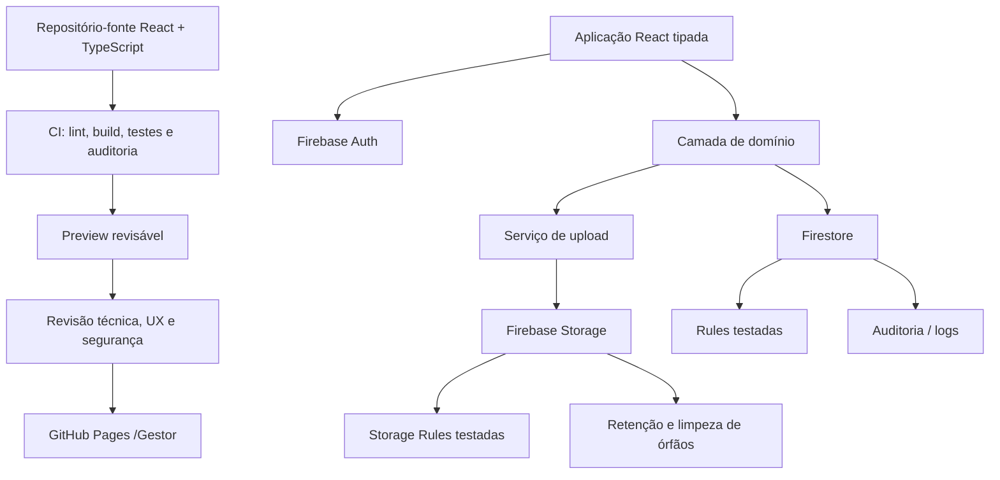

# Análise Estrutural do Reverso Gestor

**Data da auditoria:** 9 de setembro de 2026
**Autor:** Manus AI
**Escopo analisado:** branch `feat/pedidos-dossie-imagens`, commit `1ff7eb132795ffbe4137dfd60eb01507f6cd378d`
**Baseline publicada de referência:** `main`, commit `69dd8d377279252ce67f211bf6b7fc5f7489247f`
**Repositório:** [reversoworks-gestor/Gestor](https://github.com/reversoworks-gestor/Gestor)

> **Conclusão executiva:** o Reverso Gestor já possui uma base funcional de operação, com uma boa linguagem de “centro de comando”, estrutura de telas coerente e integração de autenticação e dados em tempo real. Contudo, ele está em uma condição técnica delicada para expansão: o repositório não contém o projeto-fonte React nem o ambiente de build; a interface publicada é um bundle estático; e a extensão recente de pedidos depende da estrutura interna e de rótulos do DOM. Antes de ampliar funções de negócio, a prioridade deve ser tornar o sistema **reproduzível, seguro, testável e governável**.

---

## 1. Escopo, evidências e limites da auditoria

Esta análise foi executada por leitura técnica do repositório, inspeção do bundle publicado, regras versionadas, CSS, manifesto PWA, service worker, extensão de dossiê de pedidos e prévia local em modo demonstrativo. Foram examinadas, em paralelo, as dimensões de arquitetura e dados, segurança e operação, e design, fluxos e acessibilidade.

O trabalho **não** fez alterações em Firebase, GitHub Pages, banco de dados ou regras remotas. Também não foi possível confirmar a configuração efetiva no Console Firebase, pois não havia credencial Firebase autenticada no ambiente. Portanto, todo achado sobre regras remotas é classificado como **“não comprovado em produção”** quando depende de deploy externo. O relatório diferencia observações diretas do repositório de inferências de arquitetura.

| Dimensão                 | Cobertura                                                            | Situação de evidência                               |
| ------------------------ | -------------------------------------------------------------------- | --------------------------------------------------- |
| Repositório e publicação | Inventário de arquivos, branch, commits, caminhos e PWA              | Confirmado no repositório                           |
| Runtime e dados          | Bundle, Firebase Auth, Firestore, coleções e extensão                | Confirmado por inspeção estática                    |
| Segurança                | Regras locais, fluxo de tokens, Storage e cache                      | Confirmado no código; deploy remoto não confirmado  |
| UX e design              | CSS, DOM da prévia desktop, responsividade declarada e fluxos        | Confirmado parcialmente; mobile físico requer teste |
| Produção                 | GitHub Pages, Firebase Rules ativas, dados reais e autenticação real | Não validado nesta auditoria                        |

### Escala de prioridade usada

| Classificação | Significado                                                               | Direção de tratamento                        |
| ------------- | ------------------------------------------------------------------------- | -------------------------------------------- |
| **Crítica**   | Pode comprometer confidencialidade, acesso ou operação de forma relevante | Corrigir antes de publicar a feature afetada |
| **Alta**      | Cria risco material de integridade, manutenção ou acessibilidade          | Tratar na próxima etapa de estabilização     |
| **Média**     | Impõe custo operacional, atrito ou risco que cresce com uso               | Planejar em ciclo curto de melhoria          |
| **Baixa**     | Oportunidade de robustez ou refinamento                                   | Registrar e executar conforme capacidade     |

---

## 2. Diagnóstico geral de maturidade

A tabela abaixo não mede valor de negócio. Ela mede a prontidão técnica para receber modificações recorrentes com baixo risco.

| Pilar                          | Avaliação atual | Evidência principal                                                                                        | Leitura executiva                                                            |
| ------------------------------ | --------------: | ---------------------------------------------------------------------------------------------------------- | ---------------------------------------------------------------------------- |
| Fluxos operacionais            |     **3,5 / 5** | Pedidos, produção, triagem, clientes, financeiro e estados vazios já estão estruturados                    | A base de uso interno é útil e compreensível                                 |
| Interface e navegação          |     **3,5 / 5** | Shell de dashboard, navegação por domínio, tabelas, kanban e dossiê                                        | Boa organização, com pontos de legibilidade e acessibilidade a corrigir      |
| Dados e rastreabilidade        |     **2,5 / 5** | Firestore em tempo real e metadados de imagens; ausência de schema formal                                  | Há dados operacionais, porém sem contrato versionado e validação por coleção |
| Segurança e privacidade        |     **1,5 / 5** | Membership no Firestore; risco de cache de imagens privadas; regras Storage não comprovadamente publicadas | Não liberar anexos em produção antes de endurecer este pilar                 |
| Reprodutibilidade e manutenção |       **1 / 5** | Ausência de fonte React, `package.json`, lockfile e pipeline                                               | É o principal bloqueio estrutural para evolução sustentável                  |
| Governança de publicação       |     **1,5 / 5** | Branch de feature isolada, sem evidência de checks obrigatórios e sem deploy Firebase auditável            | Exige processo de PR, validação e rollback                                   |
| Aderência ao branding oficial  |       **2 / 5** | Conceito operacional adequado, tokens e tipografia divergentes                                             | A estética conversa com a marca, mas não atende à especificação obrigatória  |

A conclusão prática é simples: **o Gestor deve entrar primeiro em uma fase de estabilização técnica**, não em uma sequência extensa de novas telas. Novas funcionalidades ainda são possíveis, mas devem ser pequenas, isoladas, testáveis e precedidas por um protocolo de mudança.

---

## 3. O que existe hoje

### 3.1 Inventário de artefatos

O repositório é uma distribuição estática. A entrada é `index.html`, que carrega um bundle JavaScript principal, um CSS principal, um módulo adicional de extensões e um CSS adicional. Não há `package.json`, lockfile, arquivos `.tsx`/`.ts` do produto, configuração Vite, sourcemaps, `.firebaserc` nem configuração completa de hosting.

| Artefato                         | Função observada                                                 | Implicação para manutenção                                                      |
| -------------------------------- | ---------------------------------------------------------------- | ------------------------------------------------------------------------------- |
| `index.html`                     | Ponto de montagem e carregamento em `/Gestor/`                   | Alterações de caminho devem respeitar o subdiretório de Pages                   |
| `assets/index-BzM7eSCj.js`       | Bundle principal React + Firebase + interface                    | É o núcleo compilado; não é uma base segura para edição manual recorrente       |
| `assets/index-BBHYoXu-.css`      | Estilos da interface-base                                        | Preserva o layout atual, mas concentra tokens fora da marca oficial             |
| `src/gestor-enhancements.js`     | Extensão de pedidos, detalhes, notas, imagens e cliente em modal | Camada útil, porém acoplada a classes e textos internos do bundle               |
| `assets/gestor-enhancements.css` | Estilos exclusivamente aditivos para a extensão                  | Menor risco visual do que alterar o CSS-base                                    |
| `assets/webp-lossless/*`         | Encoder WebP lossless em JavaScript/WASM                         | Reduz tamanho sem alterar pixels; exige teste de compatibilidade de navegador   |
| `firestore.rules`                | Regras locais de acesso aos dados                                | Existe, mas a regra remota ativa não foi confirmada                             |
| `storage.rules`                  | Regras propostas para anexos de pedidos                          | Está versionada, porém a própria nota técnica confirma que o deploy não ocorreu |
| `sw.js`                          | Service worker/PWA                                               | Necessita redesenho antes de fotos autenticadas em produção                     |
| `manifest.webmanifest`           | Metadados de instalação PWA                                      | Permite instalação básica em modo standalone                                    |
| `IMPLEMENTATION_NOTES.md`        | Registro da extensão recente                                     | Boa prática inicial de rastreabilidade; deve evoluir para changelog e runbook   |

### 3.2 Arquitetura de execução

O sistema é uma aplicação de página única, renderizada no navegador. O bundle contém React/ReactDOM, Firebase App, Firebase Authentication e Firestore. O acesso ao banco é feito diretamente pelo cliente autenticado, e o bundle assina coleções em tempo real. A autenticação e a autorização devem ser impostas pelo Firebase Rules, não pela interface; esse é o modelo correto de responsabilidade para Firebase. [1]

```mermaid
flowchart LR
  U[Operador autenticado] --> P[GitHub Pages<br/>/Gestor/]
  P --> H[index.html]
  H --> B[Bundle React compilado]
  H --> E[Módulo de extensões<br/>gestor-enhancements.js]
  B --> A[Firebase Authentication]
  B --> F[Cloud Firestore]
  E --> F
  E --> S[Firebase Storage REST<br/>imagens autenticadas]
  F --> W[workspace reverso-private]
  W --> C[clients]
  W --> O[orders]
  W --> PL[pipeline]
  W --> T[triages]
  W --> N[notes]
  W --> X[outras coleções]
  S --> I[orders/{orderId}/arquivo]
  H --> SW[Service worker]
```

> **Leitura arquitetural:** o bundle-base e a extensão coexistem na mesma página. Para a extensão operar, três símbolos internos do bundle são expostos em `window.__reversoGestorRuntime`: a instância de banco, a instância de autenticação e funções de acesso Firestore. Isto reduz a edição do bundle a três linhas, mas cria um contrato global não versionado.

### 3.3 Ponto de atenção: o código-fonte original não está no repositório

Os metadados de desenvolvimento mantidos dentro do bundle indicam arquivos como `client/src/pages/Home.tsx`, mas esses arquivos não existem no repositório. Isso significa que o Gestor foi entregue como build final, não como projeto de desenvolvimento. Não é possível reproduzir de forma confiável o bundle, atualizar dependências do núcleo ou mover a extensão para componentes nativos sem recuperar o repositório-fonte e sua cadeia de build.

Este é o maior fator de risco de manutenção. Enquanto o código-fonte não for recuperado, qualquer modificação estrutural deve ser tratada como **engenharia de compatibilidade**, não como desenvolvimento convencional.

---

## 4. Modelo de dados observado

O sistema não possui schema formal versionado. O quadro abaixo representa os campos efetivamente observados no bundle e na extensão. Ele deve ser entendido como inventário de uso, e não como contrato completo de dados.

| Coleção / documento          | Campos observados                                                                                                                                                        | Responsabilidade funcional                  | Risco atual                                                                             |
| ---------------------------- | ------------------------------------------------------------------------------------------------------------------------------------------------------------------------ | ------------------------------------------- | --------------------------------------------------------------------------------------- |
| `workspaces/reverso-private` | `name`, `ownerUid`, `allowedEmails`, `createdAt`, `updatedAt`                                                                                                            | Define espaço privado e membros autorizados | Bootstrap permite criação do workspace pelo primeiro usuário autenticado                |
| `clients`                    | `id`, `name`, `company`, `email`, `phone`, `createdAt`, `updatedAt`                                                                                                      | Cadastro e vínculo de clientes              | Sem validação de formato, unicidade ou autoria no Rules                                 |
| `orders`                     | `id`, `code`, `title`, `clientId`, `clientName`, `line`, `stage`, `priority`, `dueDate`, `material`, `partCode`, `revision`, `notes`, `images`, `createdAt`, `updatedAt` | Dossiê central do pedido                    | Sem schema; cliente e nome ficam duplicados para leitura rápida                         |
| `pipeline`                   | Dados do pedido, `id`, `orderId`, `title`, `stage`, timestamps                                                                                                           | Quadro de produção                          | Duplica dados de `orders`; pode divergir sem operação atômica                           |
| `parts`                      | `id`, `code`, `name`, `revision`, `material`, `status`, `updatedAt`                                                                                                      | Biblioteca de peças e revisões              | Contrato e integração com pedidos não formalizados                                      |
| `triages`                    | `id`, `input`, `result`, `createdAt`, `updatedAt`                                                                                                                        | Memória técnica de triagem                  | Conteúdo potencialmente complexo sem versionamento de modelo                            |
| `notes`                      | Estrutura não detalhada no fluxo auditado                                                                                                                                | Registro operacional adicional              | Coleção é assinada, mas sem contrato visível                                            |
| `estimates`, `invoices`      | Números, status, cliente, valores e datas                                                                                                                                | Financeiro                                  | Leitura no bundle; regras permitem acesso amplo a qualquer membro                       |
| `orders.images[]`            | `storagePath`, `filename`, `originalFilename`, `contentType`, `size`, `optimized`                                                                                        | Metadados de anexos                         | Não há controle de quantidade, limpeza de órfãos ou validação de relação pedido–arquivo |

### 4.1 Padrão recomendado de contrato

Antes de novas implementações, o Gestor precisa de um arquivo de contrato simples, por exemplo `docs/data-contract.md` ou schemas TypeScript/Zod, contendo para cada coleção: campos obrigatórios, tipo, limites, valor padrão, autor do registro, regra de atualização e compatibilidade de versão.

Um contrato mínimo para pedidos deveria declarar, por exemplo, que `id`, `code`, `title`, `stage`, `createdAt`, `updatedAt` e `schemaVersion` são sempre presentes; que `priority` pertence a uma enumeração fechada; que `images` tem um limite de quantidade; e que `clientName` é uma cópia de exibição derivada de `clientId`, não uma fonte concorrente de verdade.

### 4.2 Duplicação entre pedido e pipeline

A coleção `pipeline` replica parte do pedido para viabilizar o quadro de produção. Esse padrão é aceitável em Firestore quando a leitura precisa ser rápida, mas exige uma regra explícita de consistência. Hoje a extensão cria `order` e `pipeline` com operações separadas e, na edição, atualiza o pedido e depois procura um pipeline correspondente. Uma falha de rede entre essas etapas pode deixar estados divergentes.

A direção segura é escolher uma destas estratégias:

| Alternativa                                     | Quando usar                            | Recomendação                                                        |
| ----------------------------------------------- | -------------------------------------- | ------------------------------------------------------------------- |
| Derivar pipeline de `orders` em tempo real      | Volume pequeno e consultas simples     | Melhor escolha inicial; reduz duplicação                            |
| Manter projeção `pipeline` em batch/transaction | Quadro exige consulta otimizada        | Aceitável, desde que a operação seja atômica e idempotente          |
| Sincronizar por função de servidor              | Regras complexas, auditoria e alto uso | Melhor modelo de médio prazo; o cliente grava apenas o pedido fonte |

---

## 5. Fluxos funcionais e experiência operacional

### 5.1 Mapa de navegação

A estrutura de navegação está bem segmentada por domínio de trabalho. Ela transmite claramente que o Gestor é uma ferramenta de operação, não um site institucional.

| Área             | Objetivo operacional                               | Estado percebido                                                        |
| ---------------- | -------------------------------------------------- | ----------------------------------------------------------------------- |
| Visão geral      | Consolidar agenda, fábrica, caixa e itens recentes | Boa porta de entrada e leitura rápida                                   |
| Pedidos          | Criar, buscar, consultar e editar dossiês          | É o fluxo mais evoluído após a extensão                                 |
| Produção         | Acompanhar etapas no quadro                        | Kanban visualmente claro; depende de rolagem horizontal                 |
| Triagem técnica  | Coletar premissas e apoiar uma decisão técnica     | Rica em rastreabilidade, porém densa                                    |
| Peças & revisões | Organizar biblioteca técnica                       | Estrutura presente; expansão deve respeitar relação peça–pedido–revisão |
| Clientes         | Consultar e cadastrar relacionamento               | Funciona como cadastro mestre simplificado                              |
| Financeiro       | Acompanhar recebimentos e pendências               | Área de negócio separada corretamente                                   |
| Ajustes          | Gestão de espaço e acesso                          | Ponto natural para governança e preferências futuras                    |

### 5.2 Jornada de pedido

O fluxo desejado — pedido, cliente, dados técnicos, imagens, produção e triagem — existe conceitualmente e agora está mais completo. O dossiê apresenta dados importantes, notas e anexos; a edição permite correção; e o cadastro de cliente aparece sem o usuário abandonar o pedido.

| Etapa              | Como funciona atualmente                                             | Avaliação                                                                  |
| ------------------ | -------------------------------------------------------------------- | -------------------------------------------------------------------------- |
| Criar pedido       | Modal-base do bundle recebe campos adicionais por extensão           | Funciona, mas é frágil por depender do DOM original                        |
| Selecionar cliente | Select existente recebe opção “+ Criar novo cliente”                 | Boa continuidade de fluxo                                                  |
| Cadastrar cliente  | Modal aninhado preserva o formulário de pedido                       | Boa solução funcional; deve ter foco modal completo                        |
| Registrar notas    | Campo de texto longo adicionado                                      | Implementado; a posição visual deve ser corrigida antes da barra de ações  |
| Anexar imagens     | JPEG/PNG/WebP, otimização WebP lossless condicional, Storage privado | Bom desenho de armazenamento, bloqueado por risco de cache/deploy de regra |
| Abrir dossiê       | Clique na linha de pedido abre detalhe com dados e galeria           | Boa leitura e boa descoberta do fluxo                                      |
| Editar pedido      | Dossiê abre editor próprio da extensão                               | Funcional, mas apresenta risco de consistência pedido–pipeline             |

### 5.3 Pontos de atrito percebidos

1. **Notas e anexos entram depois das ações no modal-base.** A extensão os injeta após `.modal-actions`; portanto, no fluxo de criação, o usuário visualiza “Cancelar/Criar pedido” antes de chegar a Notas. Isso é uma falha de ordenação do formulário, não apenas um detalhe estético. A correção deve inserir Notas e Imagens antes do bloco de ações.

2. **“Mais opções” ainda indica “Dossiê em breve”.** A linha inteira abre o dossiê, mas o ícone de três pontos preserva uma mensagem de recurso futuro. Isso gera ambiguidade. A ação deve abrir o mesmo dossiê, exibir um menu contextual real ou ser removida até existir uma função distinta.

3. **“Filtros” é uma promessa sem comportamento final.** O botão informa que filtros virão em breve. Em uma ferramenta operacional, controles visíveis devem executar uma função ou não aparecer. A busca livre existente é útil, mas não substitui filtros de etapa, prioridade, data e cliente quando o volume crescer.

4. **Triagem técnica é tecnicamente responsável, mas extensa.** A tela explicita premissas, dados críticos ausentes, cálculo e plano de validação. Isso está alinhado à marca e à natureza do trabalho. Porém, a densidade de controles sugere uso de grupos recolhíveis, resumo de pendências persistente e preenchimento progressivo.

---

## 6. Design system e aderência ao Comando Técnico

### 6.1 O que está alinhado

A interface existente adota fundo escuro dominante, linhas finas, cartões, metadados, códigos, revisões, estágios e linguagem prudente. A triagem técnica, em particular, comunica limites e necessidade de validação, em vez de fazer promessas absolutas. A logo branca é usada sobre fundo escuro. Esses aspectos dialogam bem com os princípios de **segurança, precisão, rastreabilidade e responsabilidade** definidos pela Reverso Works.

### 6.2 O que diverge do branding obrigatório

A aderência atual é conceitual, não literal. O CSS-base usa `#07080d`, `#70e9d7`, verdes, violetas, laranjas, vermelho, fontes de sistema/SF Pro/Inter e CTAs em gradiente. Os tokens oficiais `#0A1220`, `#101C2E`, `#243751`, `#57D3D3`, `#F5F7FA`, `#A6B0BC`, Space Grotesk, Manrope e DM Mono não foram encontrados no CSS-base.

| Elemento      | Estado observado                              | Direção oficial                                          | Ajuste recomendado                                   |
| ------------- | --------------------------------------------- | -------------------------------------------------------- | ---------------------------------------------------- |
| Fundo         | Preto azulado `#07080d`                       | Azul Comando `#0A1220`                                   | Migrar por tokens sem mudar a estrutura de layout    |
| Superfícies   | Cinzas/azuis escuros e transparências         | Azul Profundo `#101C2E`                                  | Aplicar a cartões, camadas e cabeçalhos              |
| Bordas/linhas | Branco translúcido                            | Aço Azul `#243751`                                       | Normalizar separadores e grade técnica               |
| Destaques     | Ciano `#70e9d7`, gradientes e cores múltiplas | Ciano Sinal `#57D3D3`                                    | Usar ciano sólido para CTA, status e foco            |
| Status        | Verde, violeta, laranja e vermelho            | Ciano como status base; exceções semânticas documentadas | Remover verde genérico como estado normal do sistema |
| Tipografia    | SF Pro/Inter e mono do sistema                | Space Grotesk, Manrope e DM Mono                         | Definir carregamento e tokens de fonte               |
| CTA primário  | Gradiente com tipografia normal               | Ciano sólido, texto Azul Comando, DM Mono em caixa alta  | Ajustar em uma etapa controlada de branding          |

> **Decisão recomendada:** não fazer uma “reforma visual” junto com melhorias funcionais. Primeiro estabilizar arquitetura e segurança; depois executar uma migração de tokens em uma branch exclusiva de branding, com comparativos de desktop e mobile. A mudança deve preservar a grade, a navegação e os padrões operacionais que já funcionam.

### 6.3 Legibilidade e densidade

Há microtipografia entre 8 e 11 pixels em cabeçalhos de tabela, badges e rótulos. Ela contribui para a sensação técnica, mas pode reduzir leitura em monitores comuns, brilho baixo ou para pessoas com baixa visão. Além disso, o meta viewport bloqueia zoom por `maximum-scale=1, user-scalable=no`. Isto conflita com a expectativa de que texto possa ser ampliado sem perda de função; o WCAG trata explicitamente a ampliação de texto até 200% como critério de acessibilidade. [4]

A primeira correção de acessibilidade deve ser remover essas restrições de zoom. Em seguida, é necessário testar tabelas, kanban, triagem e dossiê com zoom de 200% e em larguras mobile reais.

---

## 7. Responsividade, acessibilidade e animações

### 7.1 Responsividade

A estratégia responsiva não é apenas uma redução proporcional. Em telas menores, o shell desktop é substituído por topbar, navegação inferior, menu lateral móvel, área segura de iPhone e modais como bottom sheets. A grade de detalhes muda de duas para uma coluna e a galeria de três para duas colunas. Esse é um ponto positivo de arquitetura de interface.

A área que requer validação prática é o kanban: cada coluna possui largura fixa e mantém rolagem horizontal. É aceitável quando a comparação entre colunas é importante, mas deve ser testado em 320–430 px, com teclado externo e leitor de tela.

### 7.2 Modal e foco

Os modais incluem `role="dialog"`, `aria-modal="true"`, fechamento por Escape, clique no backdrop e botão de fechar. Contudo, não existe foco preso dentro do diálogo nem restauração do foco ao acionador. No dossiê, a abertura pode deixar o foco no `body`.

A orientação WAI-ARIA recomenda que o foco entre no diálogo ao abrir, que Tab e Shift+Tab circulem nos elementos do próprio diálogo e que o foco retorne ao elemento que o abriu ao fechar. [5]

| Requisito               | Estado atual                                              | Ação necessária                                                                |
| ----------------------- | --------------------------------------------------------- | ------------------------------------------------------------------------------ |
| Foco inicial            | Parcial; funciona no campo de novo pedido, não no detalhe | Focar título estático do detalhe ou primeiro controle do formulário            |
| Confinamento de Tab     | Ausente                                                   | Implementar focus trap ou usar componente Dialog acessível no fonte recuperado |
| Retorno de foco         | Ausente                                                   | Persistir o elemento acionador e restaurá-lo ao fechar                         |
| Rótulo do diálogo       | Presente por `aria-label`                                 | Preferir `aria-labelledby` apontando para título visível                       |
| Estados de erro/sucesso | Toast visual                                              | Incluir `role="status"` ou região `aria-live`                                  |

### 7.3 Animações

As animações são curtas e discretas: backdrop e modal usam opacidade e transformação em 180–260 ms. A extensão considera `prefers-reduced-motion`. Isto está adequado ao contexto operacional. A única recomendação é manter esse limite: animações devem explicar abertura, fechamento, upload ou transição de contexto, não decorar telas de uso frequente.

---

## 8. Segurança, privacidade e operação

### 8.1 Regras Firestore: o que elas protegem

O `firestore.rules` usa negação implícita para caminhos não cobertos e restringe o workspace `reverso-private` a usuários autenticados cujo e-mail esteja em `allowedEmails`. Isso é uma base correta: Security Rules são aplicadas pelo servidor e podem proteger dados independentemente de erros da interface. [1]

Porém, todo membro pode ler e escrever qualquer subdocumento de `workspaces/reverso-private`. Não há papéis, validação de campos, autoria, imutabilidade seletiva, limite de tamanho ou proteção por coleção.

| Risco                  | Evidência local                                                                           | Prioridade | Recomendação                                                                                    |
| ---------------------- | ----------------------------------------------------------------------------------------- | ---------: | ----------------------------------------------------------------------------------------------- |
| Bootstrap do workspace | Qualquer usuário autenticado pode criar o documento raiz se ele não existir e virar owner |       Alta | Provisionar o workspace administrativamente uma única vez; não deixar criação aberta no cliente |
| Autorização ampla      | Todo membro lê e escreve todo descendente do workspace                                    |       Alta | Criar papéis: `owner`, `operator`, `viewer`; autorizar por UID/claims, não somente e-mail       |
| Sem schema nas regras  | Não há validação de campos, tipos, transições ou referências                              |       Alta | Definir regras por coleção e validar propriedades permitidas                                    |
| Sem autoria/auditoria  | Campos `createdBy`/`updatedBy` não são impostos                                           |      Média | Controlar autoria por regra ou serviço confiável; registrar audit log                           |
| Sem testes de regras   | Não há suite observada                                                                    |       Alta | Usar Firebase Emulator e `@firebase/rules-unit-testing` antes de deploy [6]                     |

### 8.2 Regras de Storage: condição de publicação pendente

A regra `storage.rules` limita anexos ao caminho `workspaces/reverso-private/orders/{orderId}/{fileName}`, exige membro autorizado, permite somente JPEG/PNG/WebP e define limite inferior a 25 MiB. Essas são validações de caminho, autenticação, tamanho e metadados suportadas pelo Cloud Storage Rules. [2]

Contudo, o registro da implementação confirma que as regras ainda não foram publicadas por ausência de login Firebase. Isso gera um bloqueio de operação: o comportamento efetivo pode ser negação total, uma regra anterior ou uma regra mais permissiva. Não se deve supor que uma regra versionada esteja ativa até que seu deploy seja feito e testado no projeto correto.

Além disso, `contentType` é um metadado fornecido pelo cliente, não uma inspeção profunda do conteúdo. O controle é útil, mas não substitui limites de dimensão, quotas, verificação de arquivo e política de retenção.

### 8.3 Risco crítico: service worker e fotos privadas

O `sw.js` intercepta todo `GET` e grava a resposta no cache, sem allowlist, expiração, separação de versões ou exclusão de requests com `Authorization`. A extensão busca imagens privadas usando token Firebase. Portanto, há risco de a mídia autenticada ser persistida no Cache Storage do navegador, inclusive após logout ou troca de usuário no mesmo perfil.

Esse é o maior bloqueador para liberar anexos em produção. O lifecycle de service workers exige estratégia explícita de cache versionado e limpeza durante ativação. [3]

**Correção obrigatória antes de publicar fotos:**

1. Cachear apenas assets estáticos same-origin, como CSS, JS, ícones e imagens públicas de marca.
2. Nunca cachear Firebase Auth, Firestore, Storage, respostas com header `Authorization` ou qualquer URL fora da origem do Gestor.
3. Versionar o cache, por exemplo `reverso-gestor-static-v2`.
4. Remover caches antigos no evento `activate` apenas quando usarem o prefixo exclusivo do Gestor.
5. Não usar o cache como fallback para requests autenticadas.
6. Limpar object URLs de imagens com `URL.revokeObjectURL()` ao fechar o dossiê ou trocar de galeria.

### 8.4 Consistência de dados e arquivos órfãos

A extensão cria pedidos e pipeline por operações não atômicas. Depois envia imagens e só então atualiza os metadados do pedido. Consequências possíveis: pedido sem pipeline, pipeline sem atualização, imagem enviada sem referência Firestore ou pedido criado sem todas as imagens após falha de rede.

O próximo estágio deve introduzir uma das seguintes garantias:

| Problema                      | Correção de curto prazo                                     | Correção estrutural                                              |
| ----------------------------- | ----------------------------------------------------------- | ---------------------------------------------------------------- |
| Pedido e pipeline divergentes | Usar batch/transaction exposto por API estável              | Pipeline derivado ou atualizado por função de servidor           |
| Imagem órfã                   | Salvar estado `uploading`; registrar falhas e reconciliação | Processamento de upload por backend/Cloud Function com lifecycle |
| Upload grande                 | Limitar quantidade e dimensões no cliente                   | Validar/reencodar em serviço confiável e aplicar quota           |
| Atualização concorrente       | Usar timestamp e política de conflito                       | Versionamento otimista e audit log                               |

### 8.5 Publicação e governança

A feature está no branch `feat/pedidos-dossie-imagens`. A baseline publicada permanece em `main`; a auditoria não publicou nada. Antes de um merge futuro, a publicação deve ter quatro gates: revisão humana, testes automatizados, validação de preview e confirmação de deploy de regras Firebase.

| Gate      | Pergunta de controle                  | Evidência necessária                                     |
| --------- | ------------------------------------- | -------------------------------------------------------- |
| Código    | A mudança é reproduzível e revisável? | Fonte, lockfile, lint, testes e diff legível             |
| Segurança | Rules e Storage estão testados?       | Testes Emulator e deploy explícito ao projeto correto    |
| Interface | Desktop e mobile preservam fluxos?    | Capturas de preview e checklist de acessibilidade        |
| Produção  | Há rollback e janela de validação?    | Commit/tag, instrução de rollback e validação pós-deploy |

---

## 9. Extensão de dossiê: avaliação técnica

A escolha de adicionar uma camada externa foi adequada como medida de preservação, pois não havia fonte React disponível. Ela evitou redesenho e reduziu o patch do bundle principal a uma pequena ponte global. A extensão também introduz aspectos positivos: clique e teclado nas linhas, modal de detalhe, cliente aninhado, imagens externas ao Firestore e WebP sem perda apenas quando menor.

Todavia, a extensão é sensível porque identifica elementos por classes e textos exatos, tais como `.modal-backdrop`, `.order-table-row`, “Novo pedido”, “Cliente” e “Nome do projeto”. Alterar uma classe, tradução ou composição do bundle pode desativar funcionalidades silenciosamente.

| Aspecto da extensão       | Benefício                                 | Limite atual                                                      | Ação de proteção                                                    |
| ------------------------- | ----------------------------------------- | ----------------------------------------------------------------- | ------------------------------------------------------------------- |
| `MutationObserver` no DOM | Injeta recursos sem alterar layout-base   | Pode reagir a mudanças inesperadas e depende da estrutura interna | Inserir timeout, feature detection e diagnóstico visível            |
| Bridge global no bundle   | Permite Firestore/Auth sem recompilar app | API não versionada e exposta globalmente                          | Definir `version`, capacidades e validação de presença              |
| Modais próprios           | Entregam dossiê e edição sem redesenho    | Gestão de foco incompleta                                         | Centralizar componente de diálogo acessível ao recuperar fonte      |
| Upload REST autenticado   | Mantém binário fora do Firestore          | Depende de rules ativas e não trata parcialidade                  | Migrar para serviço tipado e fluxo resiliente                       |
| Preview                   | Permite demonstração sem sessão           | Não valida dados persistidos, Storage ou permissões               | Marcar visivelmente como demonstração, não como teste de integração |

---

## 10. Arquitetura-alvo recomendada

A arquitetura-alvo não exige abandonar Firebase nem redesenhar o Gestor. Ela exige transformar o que já existe em um produto de manutenção previsível.



### Princípios da arquitetura-alvo

1. **Fonte antes de bundle.** Recuperar o projeto React, dependências e build. O bundle deve ser produto do pipeline, nunca unidade primária de edição.
2. **Contrato antes de coleção.** Formalizar schemas e versões de documentos.
3. **Regra antes de interface.** Toda capacidade nova deve ter cenário de `allow` e `deny` testado no Emulator antes do deploy. [6]
4. **Uma fonte de verdade.** Definir se o pipeline é derivado do pedido, projeção atômica ou projeção de backend.
5. **Cache somente de shell público.** Dados privados e mídia autenticada não pertencem ao cache offline do PWA.
6. **Mudança reversível.** Toda publicação precisa de preview, commit identificável, checklist e rollback.

---

## 11. Roadmap de estabilização e evolução

### Fase 0 — Bloqueadores de publicação de anexos

| Prioridade | Entrega                                              | Critério de aceite                                                        |
| ---------: | ---------------------------------------------------- | ------------------------------------------------------------------------- |
|         P0 | Reescrever `sw.js` com allowlist de assets estáticos | Storage/Firebase/requests autenticadas não entram no Cache Storage        |
|         P0 | Publicar `storage.rules` no projeto `reverso-works`  | Deploy explícito, teste autenticado de upload/download e teste de negação |
|         P0 | Validar cache em logout/troca de usuário             | Nenhuma foto privada reaparece offline após nova sessão                   |
|         P0 | Corrigir ordem de Notas/Imagens no modal             | Campos aparecem antes das ações e recebem foco/ordem de Tab correta       |

### Fase 1 — Estabilização de manutenção

| Prioridade | Entrega                                                              | Resultado esperado                                      |
| ---------: | -------------------------------------------------------------------- | ------------------------------------------------------- |
|         P1 | Recuperar código-fonte, `package.json`, lockfile e pipeline de build | Mudanças deixam de depender de patch de bundle          |
|         P1 | Criar contratos de dados e documentação de coleções                  | Alterações futuras têm compatibilidade e donos claros   |
|         P1 | Criar testes Firebase Emulator para Firestore e Storage              | Permissões regressivas são detectadas antes de produção |
|         P1 | Proteger `main` com PR e checks obrigatórios                         | Nenhum deploy público ocorre sem revisão e validação    |
|         P1 | Implementar operações atômicas/idempotentes de pedido–pipeline       | Menos divergência e recuperação confiável de falhas     |
|         P1 | Remover bloqueio de zoom e corrigir foco de modais                   | Melhoria imediata de acessibilidade                     |

### Fase 2 — Evolução de produto

| Prioridade | Entrega                          | Valor operacional                                                            |
| ---------: | -------------------------------- | ---------------------------------------------------------------------------- |
|         P2 | Filtros reais em Pedidos         | Busca por etapa, responsável, cliente, prioridade, vencimento e linha        |
|         P2 | Menu contextual real para pedido | Ações consistentes: abrir, editar, duplicar, arquivar, mover etapa           |
|         P2 | Histórico/audit log              | Rastreabilidade de alterações de pedido, etapa e anexos                      |
|         P2 | Gestão de anexos                 | Ordenar, remover, substituir, comentar, limitar quantidade e manter retenção |
|         P2 | Triagem progressiva              | Seções recolhíveis, pendências, autosave controlado e dados pré-preenchidos  |
|         P2 | Papéis operacionais              | Owner, operador, leitura e permissões específicas                            |

### Fase 3 — Convergência de marca e qualidade

| Prioridade | Entrega                                  | Resultado esperado                                                                 |
| ---------: | ---------------------------------------- | ---------------------------------------------------------------------------------- |
|         P3 | Migração de tokens para Comando Técnico  | Paleta, tipografia, CTA e status passam a cumprir a diretriz oficial               |
|         P3 | Auditoria de contraste e microtipografia | Interface mais legível em operação contínua                                        |
|         P3 | Testes mobile reais                      | Confirmação de kanban, triagem e modais em iPhone/Android                          |
|         P3 | Observabilidade                          | Erros de upload, falhas de Rules, abandono de formulário e uso de recursos medidos |

---

## 12. Protocolo obrigatório para futuras modificações

Até a recuperação do código-fonte, qualquer implementação deve seguir o protocolo abaixo. Ele reduz o risco de quebrar a baseline publicada.

1. **Partir de uma branch baseada em `main` ou em uma feature aprovada.** Registrar commit-base e finalidade da mudança.
2. **Inventariar o que será alterado.** Dizer se toca bundle, extensão, CSS, rules, PWA, dados ou publicação.
3. **Preferir camada aditiva.** Enquanto o fonte não existir, não editar o bundle minificado além do mínimo indispensável e documentado.
4. **Não depender apenas de texto/classe de DOM.** Se a extensão precisar observar o DOM, criar uma verificação de compatibilidade e uma mensagem de falha administrável.
5. **Modelar a alteração de dados.** Declarar campos, defaults, rollback, compatibilidade e impacto em `orders`, `pipeline` e coleções relacionadas.
6. **Escrever regras e testes juntos.** Uma funcionalidade que grava dados ou arquivos não está completa sem cenário permitido e proibido no Firebase Emulator. [6]
7. **Validar desktop e mobile.** Cobrir navegação, teclado, zoom, modais, loading, erro e estado vazio.
8. **Avaliar cache e privacidade.** Toda nova URL autenticada deve ser explicitamente excluída da estratégia offline.
9. **Gerar preview.** Conferir interface e comportamento antes de merge.
10. **Publicar com checklist.** Separar deploy de Pages, Firestore Rules e Storage Rules; confirmar cada um no ambiente correto.
11. **Registrar pós-deploy.** Anotar commit, regras aplicadas, validações e plano de rollback.

---

## 13. Backlog inicial priorizado

| ID      | Iniciativa                         | Prioridade | Dependência                | Critério de pronto                                                 |
| ------- | ---------------------------------- | ---------: | -------------------------- | ------------------------------------------------------------------ |
| GES-001 | Corrigir política de cache do PWA  |         P0 | Nenhuma                    | Requests autenticadas não são cacheadas; caches antigos são limpos |
| GES-002 | Publicar e testar Storage Rules    |         P0 | Acesso Firebase            | Upload, leitura e bloqueio de usuário externo validados            |
| GES-003 | Corrigir formulário de novo pedido |         P0 | Extensão atual             | Notas/anexos antes das ações; required e foco acessíveis           |
| GES-004 | Recuperar fonte e build            |         P1 | Acesso ao projeto original | Build reproduzível gera a prévia atual ou baseline homologada      |
| GES-005 | Contrato de dados v1               |         P1 | GES-004 preferencial       | Schemas, responsabilidades e migração documentados                 |
| GES-006 | Rules unit tests                   |         P1 | GES-005                    | Matriz de permissão por papel executada em CI                      |
| GES-007 | Operação atômica pedido–pipeline   |         P1 | GES-005                    | Não há divergência após simulação de falha                         |
| GES-008 | Filtros de pedidos                 |         P2 | GES-004                    | Filtros por cliente, etapa, prioridade e vencimento                |
| GES-009 | Histórico de alterações            |         P2 | GES-005                    | Dossiê exibe autor, data e diferença principal                     |
| GES-010 | Migração de branding               |         P3 | GES-004                    | Tokens, fontes e CTAs conformes à diretriz Comando Técnico         |

---

## 14. Decisões recomendadas para o negócio

A liderança do produto deve tomar quatro decisões antes de ampliar escopo:

1. **Definir se o Gestor será um produto interno persistente.** Se sim, recuperar o código-fonte e criar pipeline é investimento obrigatório, não opcional.
2. **Definir a política de acesso.** “Todo membro pode editar tudo” é suficiente apenas para uma equipe muito pequena e totalmente confiável. Caso haja operação por função, devem existir papéis.
3. **Definir política de anexos.** Especificar tamanho, quantidade, formatos, retenção, remoção, quem pode ver, quem pode apagar e se fotos podem conter dados sensíveis.
4. **Separar estabilização de expansão.** Os próximos recursos devem ser priorizados depois dos P0/P1. A velocidade percebida de novas telas não compensa risco de privacidade, perda de dados ou manutenção impossível.

---

## 15. Conclusão

O Reverso Gestor tem uma fundação operacional promissora. A estrutura de navegação, o quadro de produção, a triagem técnica e o novo dossiê de pedidos já expressam uma ferramenta voltada a processo e rastreabilidade. A orientação da interface é coerente com a forma de trabalho da Reverso Works.

O principal desafio não está na ideia do produto; está na **forma como o código foi preservado e publicado**. Um bundle sem fonte reduz a previsibilidade de qualquer mudança. Regras amplas, cache indiscriminado e operações não atômicas ampliam esse risco ao lidar com dados e imagens reais.

A sequência recomendada é objetiva: **corrigir cache e Storage, estabilizar acessibilidade do modal, recuperar o fonte, formalizar contratos e regras, e só então ampliar funções de negócio e migrar o branding de forma controlada**. Seguindo essa ordem, o Gestor poderá evoluir com segurança, rastreabilidade e menor custo de manutenção.

---

## Referências

[1]: https://firebase.google.com/docs/rules "Firebase Security Rules"
[2]: https://firebase.google.com/docs/storage/security "Understand Firebase Security Rules for Cloud Storage"
[3]: https://web.dev/articles/service-worker-lifecycle "The service worker lifecycle"
[4]: https://www.w3.org/WAI/WCAG21/Understanding/resize-text.html "Understanding SC 1.4.4: Resize Text"
[5]: https://www.w3.org/WAI/ARIA/apg/patterns/dialog-modal/ "Dialog (Modal) Pattern"
[6]: https://firebase.google.com/docs/rules/unit-tests "Build unit tests for Firebase Security Rules"
