# Playbook de Modificações Futuras — Reverso Gestor

**Aplicação:** Reverso Gestor, repositório `reversoworks-gestor/Gestor`
**Baseline publicada:** `main` — commit `69dd8d377279252ce67f211bf6b7fc5f7489247f`
**Regra fundamental:** não publicar uma mudança no GitHub Pages sem prévia validada e aprovação específica.

> O repositório contém o pacote estático publicado, não o código-fonte React original. Até que a fonte seja recuperada, cada alteração deve ser pequena, aditiva, documentada e validada contra a baseline.

## 1. Classificar a solicitação antes de editar

| Tipo                | Exemplos                                    | Arquivos e validações obrigatórias                                                              |
| ------------------- | ------------------------------------------- | ----------------------------------------------------------------------------------------------- |
| Interface sem dados | Texto, estado visual, CTA, tela informativa | `index.html`, CSS/extensão; prévia desktop e mobile; acessibilidade básica                      |
| Dados Firestore     | Campo, coleção, edição de pedido, filtros   | Contrato de dados, `firestore.rules`, testes Emulator, compatibilidade com registros existentes |
| Arquivos/imagens    | Upload, galeria, remoção, documentos        | `storage.rules`, teste de acesso autenticado/negado, política de cache e limpeza                |
| Fluxo operacional   | Pipeline, status, triagem, finance          | Modelo de estados, consistência, auditoria, teste de falha parcial                              |
| Branding            | Paleta, tipografia, status, CTA             | Referência `BRANDING_COMANDO_TECNICO_REVERSO_WORKS.md`; branch exclusiva; comparação visual     |
| PWA/publicação      | Service worker, paths, manifest, Pages      | Cache, atualização, rollback, base path `/Gestor/`, teste em sessão autenticada                 |

## 2. Checklist de planejamento

Antes de qualquer alteração, registrar em issue, PR ou nota de implementação:

1. **Objetivo operacional:** qual ação o usuário poderá executar após a mudança?
2. **Fonte de verdade:** quais documentos ou coleções serão criados, lidos ou atualizados?
3. **Compatibilidade:** como registros antigos continuarão funcionando?
4. **Permissão:** quem pode ler, criar, editar ou excluir?
5. **Falhas possíveis:** o que acontece se a rede cair entre duas gravações ou durante um upload?
6. **Cache e privacidade:** a funcionalidade usa dados autenticados, arquivos privados ou respostas que não podem ficar offline?
7. **Critério de aceite:** quais ações precisam funcionar em desktop, mobile, teclado e sessão real?
8. **Rollback:** qual commit ou release será usado para reverter?

## 3. Fluxo de trabalho recomendado

```mermaid
flowchart LR
  A[Solicitação] --> B[Classificar impacto]
  B --> C[Definir contrato de dados e permissões]
  C --> D[Criar branch de feature]
  D --> E[Implementar mudança isolada]
  E --> F[Testar sintaxe, Rules e preview]
  F --> G[Validar desktop, mobile e acessibilidade]
  G --> H[Revisão e aprovação]
  H --> I[Publicar regras Firebase quando aplicável]
  I --> J[Merge e publicação Pages]
  J --> K[Smoke test e registro pós-deploy]
```

## 4. Convenção de branches e commits

| Caso         | Branch sugerida       | Commit sugerido                               |
| ------------ | --------------------- | --------------------------------------------- |
| Nova função  | `feat/nome-curto`     | `feat: descreve a capacidade`                 |
| Correção     | `fix/nome-curto`      | `fix: descreve a correção`                    |
| Segurança    | `security/nome-curto` | `security: descreve a proteção`               |
| Branding     | `brand/nome-curto`    | `style: align interface with comando tecnico` |
| Documentação | `docs/nome-curto`     | `docs: descreve a documentação`               |

Nunca usar `main` como ambiente de experimento. O branch de feature deve partir de um commit de baseline conhecido e documentar esse commit na descrição da alteração.

## 5. Regras de dados e permissão

### Firestore

Para uma coleção nova ou campo novo, definir:

| Pergunta         | Exemplo para pedidos                                                      |
| ---------------- | ------------------------------------------------------------------------- |
| Quem cria?       | Operador autorizado                                                       |
| Quem atualiza?   | Operador responsável ou owner                                             |
| Quem exclui?     | Owner, ou preferencialmente arquivamento lógico                           |
| Campos imutáveis | `id`, `createdAt`, `createdBy`, `code` se não houver regra de renumeração |
| Campos validados | `stage`, `priority`, `dueDate`, `clientId`, limites de `notes` e `images` |
| Auditoria        | `updatedAt`, `updatedBy`, evento de alteração relevante                   |

As Rules devem ser testadas no Firebase Emulator antes do deploy. Security Rules existem para impor autorização no servidor; nunca depender de botões ocultos ou validação apenas na interface. [1]

### Storage

Para anexos, definir formato, tamanho, quantidade, retenção e quem pode remover. A regra deve separar `read`, `create`, `update` e `delete` quando houver políticas diferentes. Validação de `contentType` e tamanho é útil, mas não substitui processamento confiável de conteúdo, quota ou verificação de relação entre arquivo e pedido. [2]

> **Bloqueio atual:** não liberar imagens em produção enquanto o service worker ainda fizer cache indiscriminado de GETs autenticados e enquanto `storage.rules` não estiver comprovadamente publicada no Firebase.

## 6. Política de PWA e cache

Apenas assets públicos e versionados do próprio Gestor podem entrar no Cache Storage: HTML, CSS, JavaScript, fontes, ícones e imagens institucionais. Não cachear respostas com `Authorization`, endpoints Firebase, Firestore, Storage, API ou fotos de pedido.

Em cada atualização de service worker, usar um nome de cache versionado e remover apenas caches antigos com prefixo exclusivo do Gestor durante a ativação. O ciclo de instalação e ativação deve ser tratado como parte do release, pois versões diferentes podem coexistir entre abas. [3]

## 7. Validação mínima por mudança

| Categoria  | Validação obrigatória                                                                                               |
| ---------- | ------------------------------------------------------------------------------------------------------------------- |
| Código     | Verificação de sintaxe, `git diff --check`, revisão do diff e bundle carregando sem erro                            |
| Dados      | Documento criado/atualizado, estado vazio, compatibilidade com dados antigos e cenário de falha                     |
| Rules      | Usuário externo negado, usuário autorizado permitido, usuário de leitura bloqueado para escrita, owner validado     |
| Imagens    | JPEG/PNG/WebP, limite de tamanho, upload interrompido, leitura autenticada, logout/troca de usuário e cache offline |
| Interface  | Desktop e mobile, vazio/loading/erro, tabulação, Escape, foco e zoom de 200%                                        |
| Branding   | Cores, tipografia, CTA, status e logo comparados ao Comando Técnico                                                 |
| Publicação | Caminho `/Gestor/`, service worker atualizado, revisão da URL publicada e plano de rollback                         |

Para diálogos, o foco deve entrar no modal, permanecer nele durante Tab/Shift+Tab e voltar ao acionador ao fechar. [4] O Gestor também não deve impedir que usuários ampliem texto ou conteúdo; WCAG orienta que o texto seja escalável até 200% sem perda de funcionalidade. [5]

## 8. Checklist pré-publicação

- [ ] A mudança está em branch própria e o commit-base está registrado.
- [ ] O impacto em Firestore, Storage e cache foi avaliado.
- [ ] Há contrato documentado para qualquer novo campo ou coleção.
- [ ] Rules foram testadas no Emulator quando dados/arquivos foram alterados.
- [ ] Nenhum dado privado é cacheado, exposto em preview ou persistido no bundle.
- [ ] Desktop e mobile foram revisados.
- [ ] Navegação por teclado, foco de modal e zoom foram validados.
- [ ] O design respeita o branding oficial quando a mudança for visual.
- [ ] A documentação de implementação foi atualizada.
- [ ] O rollback é conhecido e executável.
- [ ] Há aprovação específica para atualizar GitHub Pages.

## 9. Checklist pós-publicação

- [ ] A URL `https://reversoworks-gestor.github.io/Gestor/` carrega os assets esperados.
- [ ] O service worker foi atualizado sem servir shell antigo.
- [ ] Auth, leitura e escrita real foram validados por uma conta autorizada.
- [ ] Regras Firebase ativas correspondem ao arquivo versionado.
- [ ] Upload de imagem autorizado funciona e usuário não autorizado é bloqueado.
- [ ] Dados não aparecem após logout ou troca de conta no mesmo navegador.
- [ ] O commit, data, regras aplicadas e resultado dos smoke tests foram registrados.

## Referências

[1]: https://firebase.google.com/docs/rules "Firebase Security Rules"
[2]: https://firebase.google.com/docs/storage/security "Understand Firebase Security Rules for Cloud Storage"
[3]: https://web.dev/articles/service-worker-lifecycle "The service worker lifecycle"
[4]: https://www.w3.org/WAI/ARIA/apg/patterns/dialog-modal/ "Dialog (Modal) Pattern"
[5]: https://www.w3.org/WAI/WCAG21/Understanding/resize-text.html "Understanding SC 1.4.4: Resize Text"
